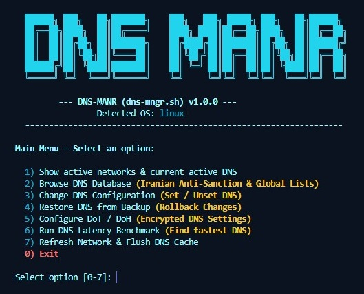
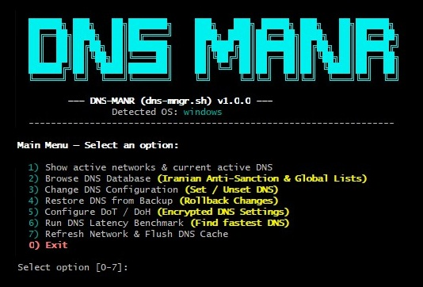

# 🌐 DNS-MANR

> **A lightweight, interactive cross-platform CLI tool for managing, benchmarking, and securing DNS settings across Linux, macOS, and Windows.**

<p align="center">
  
  
  
  
  <a href="./LICENSE">
    
  </a>
</p>

---

**DNS-MANR** simplifies cross-platform DNS selection, latency benchmarking, and automated configuration. It offers specialized anti-sanction/gaming DNS options for Iranian users alongside top-tier global security providers, complete with automated backup/restore functionality and DoT/DoH setup support.

---

## 🖼️ Preview

Cross-platform terminal interface running smoothly across Linux, macOS, and Windows environments.

| Linux (Ubuntu/Debian) | macOS | Windows (Git Bash/MSYS2) |
|:---:|:---:|:---:|
|  |  |  |

---

## 🚀 Getting Started

### Single File Structure


```

dns-mngr.sh    # Standalone, zero-dependency Bash script for complete cross-platform DNS setup

```

## Installation & Execution

### Running the Application

#### Option 1: One-Line Remote Execution (Recommended)

```bash
curl -sSL https://raw.githubusercontent.com/AlirezaNoorizadeh/DNS-MANR/main/dns-mngr.sh | sudo bash

```

#### Option 2: Clone & Execute Directly

```bash
git clone [https://github.com/AlirezaNoorizadeh/DNS-MANR.git](https://github.com/AlirezaNoorizadeh/DNS-MANR.git)
cd DNS-MANR
chmod +x dns-mngr.sh
sudo ./dns-mngr.sh

```

> **Note:** Root, sudo, or Administrator privileges are required to modify network interface configurations (NetworkManager, networksetup, or netsh).

---

## 🌟 Core Features

### Universal OS Support

* 🐧 **Linux** (Ubuntu, Debian, Fedora, Arch, WSL) - Automated configuration via NetworkManager (`nmcli`), `systemd-resolved`, or Direct `/etc/resolv.conf`.
* 🍎 **macOS** - Native support for network services using `networksetup`.
* 🪟 **Windows** - Native interface management using `netsh` (via Git Bash / MSYS2).

### Smart Configuration & Benchmark

* ⚡ **Live Latency Benchmark** - Auto-pings servers and presents DNS options pre-sorted by lowest latency (lowest ping first).
* 🇮🇷 **Iranian Anti-Sanction & Gaming Presets** - Built-in presets for Shecan, Begzar, Radar Game, 403 Online, Electro, and more.
* 🌐 **Global Security Presets** - Instant access to Cloudflare, Google, Quad9, OpenDNS, NextDNS, and AdGuard.
* 💾 **Automated Safety Backups** - Saves a snapshot of your network settings to `~/.dns_manager_backups` before making any changes.
* 🔄 **One-Click Rollback** - Easily restore previous DNS or DHCP configurations from backup files.

### Secure Encrypted DNS (DoT / DoH)

* 🔒 **DNS over TLS (DoT)** - Native automated configuration via `systemd-resolved` on Linux.
* 🌐 **DNS over HTTPS (DoH)** - Detailed guide and parameters provided for system-wide profiles or browser integration (Chrome, Firefox, Edge) across all operating systems.
* 📑 **OS-Dynamic OS Guides** - Displays step-by-step UI instructions filtered specifically for your active operating system.

---

## 🛠️ Technical Implementation

### Architecture

* Self-contained POSIX-compliant Bash script with zero mandatory heavy dependencies.
* **Auto OS Detection** - Detects environment (Linux, macOS, Windows, WSL) at launch and dynamically adapts commands and help panels.
* **Fallback Mechanisms** - Automatically switches to manual guidance when native automated OS-level changes are not supported (e.g., macOS system profiles or non-systemd Linux).
* **Colorized Interactive TUI** - Clean, scannable ANSI terminal interface.

### Supported DNS Environments

* **Iranian Providers:** Shecan, Begzar, Radar Game, 403 Online, Electro, Vanilla, Shelter, HostIran, Shatel, DNS Pro, and more.
* **Global Providers:** Cloudflare (1.1.1.1), Google Public DNS (8.8.8.8), Quad9 (9.9.9.9), OpenDNS, NextDNS, AdGuard, CleanBrowsing, UncensoredDNS, Yandex.DNS.

---

## 🎮 How to Use

### 1. Launch & Status Overview

1. Run `sudo ./dns-mngr.sh` in your terminal.
2. Select Option 1 to inspect all active network interfaces and their currently set DNS servers.

### 2. Set DNS Configurations

1. Select Option 3 -> 1 (Set DNS).
2. Pick your active interface (e.g., Eth0, Wi-Fi, Ethernet).
3. Choose between Iranian (Anti-Sanction) or Global categories.
4. The script will ping the servers and display them sorted by speed. Select your target DNS to apply it.

### 3. Revert to Automatic DNS (DHCP)

1. Select Option 3 -> 2 (Unset DNS).
2. Select your interface to remove custom DNS servers and return to ISP automatic assignment.

### 4. Restore Previous Backups

1. Select Option 4 (Restore DNS from Backup).
2. Pick a snapshot timestamp to revert your system back to its exact previous network state.

### 5. Configure DoT / DoH (Encrypted DNS)

1. Select Option 5.
2. Review the OS-specific guide for your environment and select a provider to view or automatically configure its DoT Host and DoH URL parameters.

---

## ⚙️ System Diagnostic & Utility Tools

* **DNS Latency Benchmark (Option 6):** Runs a latency test across all primary DNS endpoints in the database without modifying your current settings.
* **DNS Cache Flush (Option 7):** Instantly flushes DNS resolver caches (`resolvectl`, `dscacheutil`, or `ipconfig /flushdns`).

---

## 📋 Supported Platforms

| OS Family | Support Level | Primary Engine / Backend |
| --- | --- | --- |
| **Linux** | Full Auto / Native | `nmcli`, `systemd-resolved`, `/etc/resolv.conf` |
| **macOS** | Full Auto / Native | `networksetup`, `dscacheutil` |
| **Windows** | Full Auto / Native | `netsh.exe`, `ipconfig` (via Git Bash / MSYS) |
| **WSL** | Auto / Manual Fallback | `resolv.conf` / Windows host networking |

---

## 🚦 Requirements

### System Requirements

* Bash 4.0+ shell environment
* Root or Administrative privileges (`sudo`)
* Core CLI tools: `curl`, `ping`, `awk`, `sed`, `grep`

---

## 🔧 Troubleshooting

### Common Issues

1. **Permission Denied** - Run the script using `sudo ./dns-mngr.sh` or Administrator Git Bash.
2. **Ping Benchmarks Timeout** - Some network firewalls block ICMP ping packets. The DNS servers might still be functional even if pings time out.
3. **Changes Not Reflecting in Browser** - Browsers often cache DNS queries or use their own built-in Secure DNS. Flush your browser cache or run Option 7 to clear system DNS.

---

## 📜 License

This project is licensed under the MIT License.

---

## 🙏 Credits

Thanks to:

* Iranian Anti-Sanction Providers (Shecan, 403.online, Radar Game, Begzar, Electro) for maintaining public servers for software developers and gamers.
* Global Privacy Initiatives (Cloudflare, Quad9, AdGuard, OpenDNS) for providing reliable public DNS infrastructure.

---

> A robust, cross-platform CLI assistant designed to deliver fast, secure, and hassle-free DNS management across Linux, macOS, and Windows.